# Transcription Retry Flow Diagram

This diagram illustrates the retry logic with exponential backoff for transcription service rate limit errors (503).

## Flow Diagram

```mermaid
flowchart TD
    subgraph Frontend["Frontend Layer"]
        A[🎤 User records audio] --> B[process_audio_from_bytes]
        B --> C["recording_state = 'processing'"]
    end

    subgraph RetryLoop["Retry Loop (max 3 retries)"]
        C --> D{attempt = 0}
        D --> E[API Client: POST /api/transcribe]
    end

    subgraph Backend["Backend Layer"]
        E --> F[transcribe_audio endpoint]
        F --> G[Call OpenAI Whisper API]
    end

    G --> H{Response?}
    
    H -->|200 OK| I[✅ Success]
    H -->|503 Rate Limit| J{attempt < 3?}
    H -->|400/500 Other Error| K[❌ Fail immediately]

    J -->|Yes| L["recording_state = 'retrying'"]
    L --> M["Sleep: 1s → 2s → 4s<br/>(exponential backoff)"]
    M --> N[attempt++]
    N --> E

    J -->|No| O[❌ Max retries exhausted]

    I --> P["recording_state = 'submitting'"]
    P --> Q[Auto-submit answer]

    K --> R["recording_state = 'error'"]
    O --> R

    subgraph UIFeedback["UI Feedback States"]
        S["🔄 Transcribing..."]
        T["🔄 Retrying transcription (attempt X/3)..."]
        U["📤 Submitting answer..."]
        V["❌ Error: message"]
    end

    C -.-> S
    L -.-> T
    P -.-> U
    R -.-> V

    style A fill:#e1f5fe
    style I fill:#c8e6c9
    style K fill:#ffcdd2
    style O fill:#ffcdd2
    style R fill:#ffcdd2
    style Q fill:#c8e6c9
```

## State Transition Diagram

## Sequence Diagram

## Related

- [Feature 0012 Plan](../features/0012_PLAN.md)
- [Feature 0012 Review](../features/0012_REVIEW.md)

